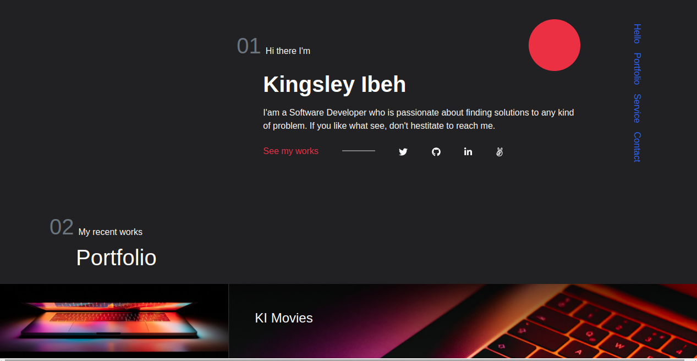

# Portfolio

> This repo host the code for my personal portfolio



## Built With

- Rails 6.0.3.4
- Ruby 2.7.1
- Bootstrap
- Sass

## Live Demo

(https://ibehkingsley.herokuapp.com/)

## Getting Started

To get a local copy up and running follow these simple example steps.

### Prerequisites

You should have [Ruby 2.7.1](https://www.ruby-lang.org/en/documentation/installation/) installed on your machine along with [Rails 6.0.3.4](http://railsinstaller.org/en) and [PostgreSQL](https://www.postgresql.org/download/).


### Setup

Open your terminal, type `git clone git@github.com:Kingobaino1/my_portfolio.git` and hit Enter to download this repository.

Instal gems with:

```
bundle install
```

Install the required dependencies via:

```
yarn install
```

Setup database with:

```
   rails db:create
   rails db:migrate
```


### Usage

- Start server by typing `rails server` on your terminal in the root directory of the project

- Open `http://localhost:3000/` in your browser.

- Sign up to start using the app.


### Run tests
> To run test, simply type `rspec` on your terminal.

## Author 

👤 **Kingsley Ibeh**

- Github: [@githubhandle](https://github.com/Kingobaino1)
- Twitter: [@twitterhandle](https://twitter.com/ibehkingso)
- Linkedin: [linkedin](https://www.linkedin.com/in/kingsley-ibeh)

## 🤝 Contributing

Contributions, issues and feature requests are welcome!

Feel free to check the [issues page](https://github.com/Kingobaino1/my_portfolio/issues).

## Show your support

Give a ⭐️ if you like this project!

## Acknowledgments

- undraw

## License

This project is [MIT](./LICENSE) licensed.
